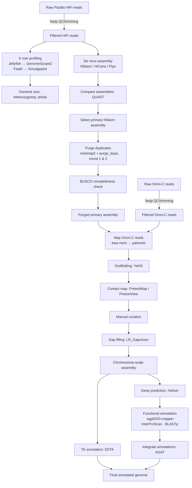

#  Star Apple Genome Analysis

**Chromosome-scale genome assembly and annotation of the white star apple (*Gambeya albida*)**

This repository documents the commands, parameters, and software versions used to produce the first chromosome-scale, reference-quality genome assembly and annotation of the white star apple (*Gambeya albida*). It accompanies the preprin:

> Landi, M., Muzemil, S., Adediji, A., Ondari, L. *et al.* (2026). **Chromosome-scale genome assembly and annotation of the white star apple (*Gambeya albida*).** *Research Square* (preprint). https://doi.org/10.21203/rs.3.rs-9271727/v1


---

## Genome at a glance

| Metric | Value |
|---|---|
| Estimated haploid genome size | ~822 Mbp |
| Final assembly size | ~814 Mbp |
| Heterozygosity | 0.317% (highly homozygous) |
| Pseudochromosomes | 13 |
| Final N50 | 57 Mbp |
| BUSCO completeness (genome) (eudicots_odb10) | 97.5% |
| BUSCO completeness (protein) (eudicots_odb10) | 92.4% |
| Base-level accuracy (QV, Merqury) | 58.14 |
| Repeat content | ~58.6% |
| Predicted gene models | 33,607 |

---

## Repository structure

The folders are organized in the order of the analysis pipeline:

```
StarAppleGenomeAnalysis/
├── qc/                     # Read quality control & trimming
│   └── qc.sh
├── SizePrediction/         # K-mer based genome size, heterozygosity & ploidy estimation
│   └── kmer.sh
├── asm/                    # De novo genome assembly + assembly comparison
│   └── asm.sh
├── purging/                # Haplotig/duplicate purging (2 rounds) + BUSCO checks
│   └── purge_dups.sh
├── scaffolding/            # Omni-C scaffolding, manual curation & gap filling
│   ├── map.sh
│   └── requirements.txt
├── anno/                   # Transposable element & gene annotation
│   └── TEandGeneAnnotation.sh
├── LICENSE
└── README.md
```

---

## Pipeline overview



---

## Data availability

| Resource | Accession |
|---|---|
| PacBio HiFi reads (SRA) | [SRR33323859](https://www.ncbi.nlm.nih.gov/sra/SRR33323859) |
| Omni-C reads (SRA) | [SRR33422445](https://www.ncbi.nlm.nih.gov/sra/SRR33422445) |
| Genome assembly (GenBank) | [JBNXVW000000000](https://www.ncbi.nlm.nih.gov/nuccore/JBNXVW000000000) |
| Annotation files | [Zenodo](https://doi.org/10.5281/zenodo.20794479) |

---

## Reproducibility notes

These scripts capture the **literal commands run on the original analysis server** rather than a packaged, push-button pipeline. Before reusing them:

- File paths (e.g. `/data01/mlandi/...`, `/data2/StarApple/...`) are specific to the authors' HPC environment and need to be replaced with your own paths.
- Steps should generally be run in the order the folders are listed above (`qc` → `SizePrediction` → `asm` → `purging` → `scaffolding` → `anno`), since later steps consume the outputs of earlier ones.
- Most tools are easiest to install via [conda/mamba](https://github.com/conda-forge/miniforge) (e.g. via `bioconda`); a few (Helixer, LR_Gapcloser, EDTA) are best installed from source as described in their own repositories.
- The Python environment for the scaffolding/curation step can be created from [`scaffolding/requirements.txt`](scaffolding/requirements.txt).
